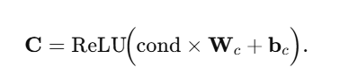

# Generative learning assisted state-of-health estimation for sustainable battery recycling with random retirement conditions

***

**📅 出版年份:2024\ 📖 出版期刊:Nature Communications\ 📈 影响因子:14.7\ 🧑 文章作者:Tao Shengyu,Ma Ruifei,Zhao Zixi,Ma Guangyuan,Su Lin,Chang Heng,Chen Yuou,Liu Haizhou,Liang Zheng,Cao Tingwei,Ji Haocheng,Han Zhiyuan,Lu Minyan,Yang Huixiong,Wen Zongguo,Yao Jianhua,Yu Rong,Wei Guodan,Li Yang,Zhang Xuan,Xu Tingyang,Zhou Guangmin**

***

## 🔎 摘要:

Rapid and accurate state of health (SOH) estimation of retired batteries is a crucial pretreatment for reuse and recycling. However, data-driven methods require exhaustive data curation under random SOH and state of charge (SOC) retirement conditions. Here, we show that the generative learning-assisted SOH estimation is promising in alleviating data scarcity and heterogeneity challenges, validated through a pulse injection dataset of 2700 retired lithium-ion battery samples, covering 3 cathode material types, 3 physical formats, 4 capacity designs, and 4 historical usages with 10 SOC levels. Using generated data, a regressor realizes accurate SOH estimations, with mean absolute percentage errors below 6% under unseen SOC. We predict that assuming uniform deployment of the proposed technique, this would save 4.9 billion USD in electricity costs and 35.8 billion kg CO2 emissions by mitigating data curation costs for a 2030 worldwide battery retirement scenario. This paper highlights exploiting limited data for exploring extended data space using generative methods, given data can be time-consuming, expensive, and polluting to retrieve for many estimation and predictive tasks.

***

## DOI: <https://www.nature.com/articles/s41467-024-54454-0>

环境变量可用切入逻辑

1.  核心嵌入点：作为额外的前馈（密集）层（加上激活）来实现***### More Detail

    1.  **Condition variables** (e.g., SOC, SOH) start off as small-dimensional vectors: `[SOC, SOH]` → shape `(batch_size, 2)`.

    2.  **Embedding layer**: A fully connected layer + activation projects `(batch_size, 2)` → `(batch_size, 64)`.

    3.  This 64D vector C\mathbf{C} is then fed forward into the **cross-attention** mechanism (along with the main features).

    So when people say “*embed the condition variables*,” they’re typically referring to creating a **separate layer** that turns the raw numeric inputs into a learned representation—just like how, in NLP, you might embed a word index into a 128D embedding vector. Here, you are embedding a 2D numeric vector into 64D.

2.  具体方法：Below is a high-level explanation of **how the paper’s machine-learning (ML) “code logic” handles input variables** (like state of charge, state of health, etc.) and **how those variables influence the model outputs** (the “numerator” or pulse-voltage responses, in this case). While the paper focuses on generative modeling for battery state-of-health rather than strictly molecular modeling, the same kind of question arises: *How are extra variables embedded or used within the model?****## 1. Overall Model Structure: A Conditional Variational Autoencoder (CVAE)The authors use a **variational autoencoder (VAE)** variant called a **conditional VAE (CVAE)**. The key aspect of a CVAE is that you do not merely encode and decode a single dataset of features; you also **condition** the generation or reconstruction process on extra inputs (called *conditions*).In the paper, these extra inputs are:

    *   **Retirement condition variables** (e.g., state of charge, SOC; state of health, SOH).
    *   **Pulse voltage response features** (21-dimensional measurements).

    ### Why “conditional”?Because the authors want to *generate* or *reconstruct* battery pulse-response data *specifically at certain SOC and SOH values*. That is exactly what “conditional” means in a CVAE: the encoder and decoder networks each take in both the main input (pulse-voltage features) **and** the side-variables (SOC, SOH).***## 2. How the Side Variables Are EmbeddedInside the encoder (and similarly in the decoder), these extra variables (SOC and SOH) are handled by **embedding layers** that convert them into a higher-dimensional vector. The paper denotes this step as:C=ReLU(cond×Wc+bc),C = \text{ReLU}\bigl(\text{cond} \times W\_c + b\_c\bigr),where

    *   cond=\[SOC, SOH]\text{cond} = \[\mathrm{SOC},\\, \mathrm{SOH}]
    *   CC becomes a 64-dimensional embedding vector
    *   ReLU\mathrm{ReLU} is the activation function
    *   WcW\_c and bcb\_c are learned parameters

    Then, the main pulse-voltage input xx (which is 21-dimensional) is **also** mapped into a 64-dimensional vector HH. The authors call the transformation of xx:H=ReLU(x×Wh+bh).H = \text{ReLU}\bigl(x \times W\_h + b\_h\bigr).Hence, both the main input xx and the condition CC get embedded into the *same dimensional space* (64D).***## 3. Cross-Attention Links the Condition to the Main InputAfter embedding, the paper’s key technique is the **cross-attention** block. Cross-attention is basically a mechanism that helps the network learn “how does the condition (SOC, SOH) specifically modulate each part of the pulse-voltage feature vector?”Mathematically, cross-attention says:Atten=softmax(QKTdk)  V,\text{Atten} = \text{softmax}\Bigl(\frac{Q K^{T}}{\sqrt{d\_k}}\Bigr) \\; V,where

    *   QQ is the “query”—in this case, the embedded pulse-voltage features HH.
    *   KK and VV are “key” and “value”—the embedded condition CC.

    This attention operation merges the two streams of data. It effectively answers: *“Which parts of the condition vector CC matter most for the current pulse-voltage features HH, and how strongly do they matter?”***In simpler terms:** The condition (SOC,SOH)(\mathrm{SOC},\mathrm{SOH}) is not just appended to the input vector. Instead, the model learns to “attend to” or *focus on* the parts of SOC and SOH that best explain or reconstruct the 21 voltage features.***## 4. Does the Model “Embed Variables Before Substituting Them” or “Use Them as a Link”?**Short answer:** They do *both*:

    1.  The SOC/SOH condition is **embedded** (a standard neural-network step that transforms raw numeric inputs into a more expressive representation).
    2.  The *link* is provided by the **cross-attention** layer, which merges the condition embedding with the main features.

    In other words, the condition variables are:

    *   Not merely concatenated to the input.
    *   Not just used as a “numerator” or extra scalar.
    *   **But** are run through a learnable embedding and *then* used in an attention mechanism that weighs how SOC/SOH shape the pulse-voltage data.

    Hence, the CVAE’s “code logic” ensures that the effect of these condition variables is explicitly woven into the generative process.***## 5. How This Affects the Model OutputsOnce cross-attention merges the condition with the main features, the encoder compresses the entire representation into a lower-dimensional **latent variable**. The decoder receives random noise + condition again (SOC, SOH) and re-generates (or “reconstructs”) the pulse-voltage features.This generative approach means:

    *   You can plug in a new SOC/SOH condition (even if it was never directly measured), sample from the latent space, and *generate* the likely pulse-voltage signatures for that scenario.
    *   Because the generative model learned the relationship between (SOC,SOH)(\mathrm{SOC}, \mathrm{SOH}) and the 21 voltage features, you see how changes in SOC\mathrm{SOC} or SOH\mathrm{SOH} *drive changes* in the final response.

    ***## 6. Summary of How the Variables Are Used

    1.  **They are embedded** so the model can handle them as learned, high-dimensional vectors.
    2.  **They serve as a link via cross-attention** so that the network learns precisely how SOC\mathrm{SOC} and SOH\mathrm{SOH} modulate the pulse-voltage curves.
    3.  **They condition the generation** of new data, meaning if you change SOC\mathrm{SOC}/SOH\mathrm{SOH}, you get correspondingly different outputs.
    4.  The output of the model is not strictly a “numerator,” but a 21-dimensional vector of voltage-response features.

    Because of this approach, the paper can “fill in” missing conditions in the dataset (like an untested SOC level), which is exactly how they handle *random battery retirement conditions* without paying the cost (in time/energy) to measure pulses at every single SOC.***### Take-Home Point> The authors incorporate extra variables—SOC and SOH—by **embedding** them and then **attending** to them in both the encoder and decoder. This architecture (the *conditional variational autoencoder with cross-attention*) lets the model learn how changes in those side-variables drive or correlate with the final generated voltage features—*effectively “linking” the condition variables to the outcome.*

3.  参考方向：
